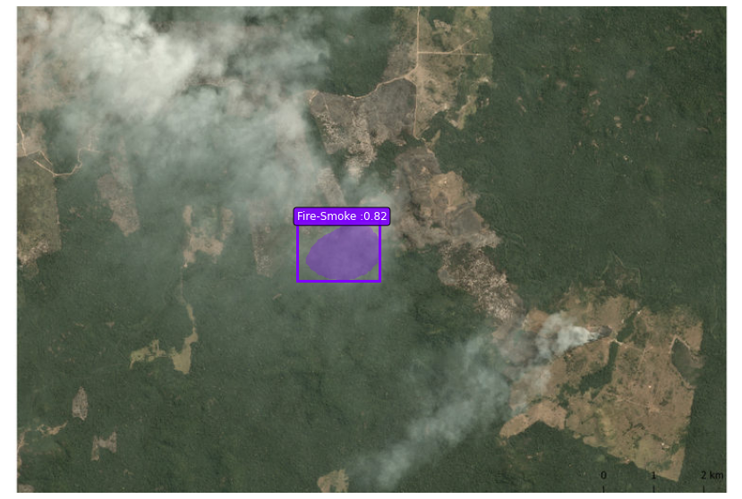

# Code

The app functionality was divided in the following parts:

## Frontend design

Using an application we created a scheme of the way the application would work, but is not functional.

## Backend

- Getting the data: We got the data of wildfires from the kaggle database of Australia and using the CVStudio program, we labeled the zones where we found fire smoke. In addition, we made use of the AWS dataset provided for the challenge.

- Trainning the algorithm: We used two main programs that we found for the algorithm trainning: FalconCV, making use of the Australia data and Mask RCNN, ad using as well the AWS data, where we separated the layers of each image with an image public editor.

- Sending fire alerts: We propose a code for sending WhatsApp alerts when wildfires happen near them.

- Report wildfires.

# Results

## Frontend

A complete scheme of the application is shown in: https://xd.adobe.com/view/1ae52780-4597-4d91-b26b-0259d5d75c86-4fb6/

## Backend

### With FalconCv

  

  

### With Masks RNNC

  

In both cases, the detection of the wildfires smoke is poor. This is caused mainly because the dataset that the algorithm was based on have not so many images to be analized. A good dataset has to be, at minimun, composed of 10k images.

# References
- Mask RNNC: https://github.com/matterport/Mask_RCNN
- Henry Ruiz, David Lopera. FalconCV, an open-source transfer learning library that offers developers an interface to interact with some of the most popular computer vision frameworks. https://github.com/haruiz/FalconCV
