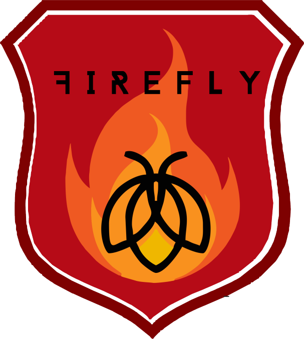

# FireFly

  

## Brief description
This project is being developed as part of the NASA International Space Apps Challenge 2020 in the category "Automated detection of Hazards". We aim to design an app capable of identifying fires and performing an asessment of the potential environmental impact produced by these hazards.

## This repository
In this repository you will find our source 
 
## About us
We are a group of four physicists, an industrial engineer and a software developer from Colombia.
