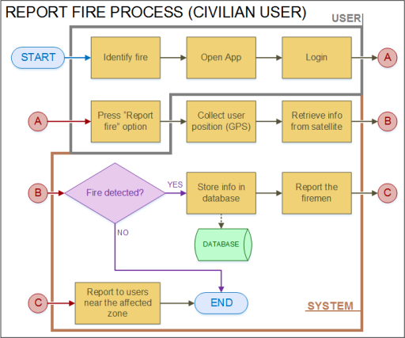
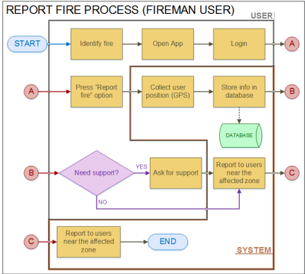

# Socialization Information

## Chosen locations
At the beginning our app will be implemented on the municipalities belonging to the Orinoquía natural region in Colombia. Nevertheless, due to the universality of the classifications performed by the algorithms it can be extended to others regions.
## Target users
Residents of the specified municipalities as well as the fire departments subscribed to these municipalities. Furthermore, our data could be used by environment related institutions operating in the Orinoquía region, such as CORMACARENA and CORPORINOQUIA, within their frameworks of disaster prevention and mitigation.

  

  

## Variables involved in the impact assessment:

During the evaluation of the possible consequences of bushfires, the following factors could be taken into account:  

-AQI (Air Quality Index) of the region before and after the fires.  
-Density of animal species and vegetation in the region.  
-Proximity of the fire location to urban and rural centres.

## App features
The flowcharts representing the functioning of the app for the different target users are included in this folder.
  

